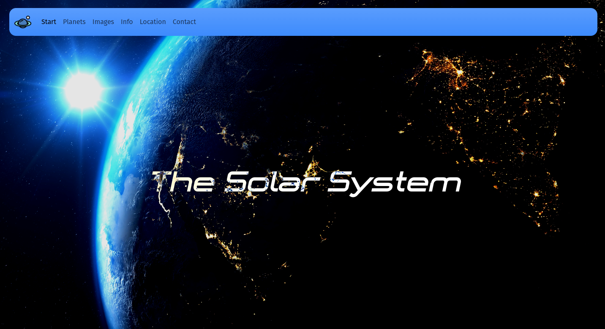
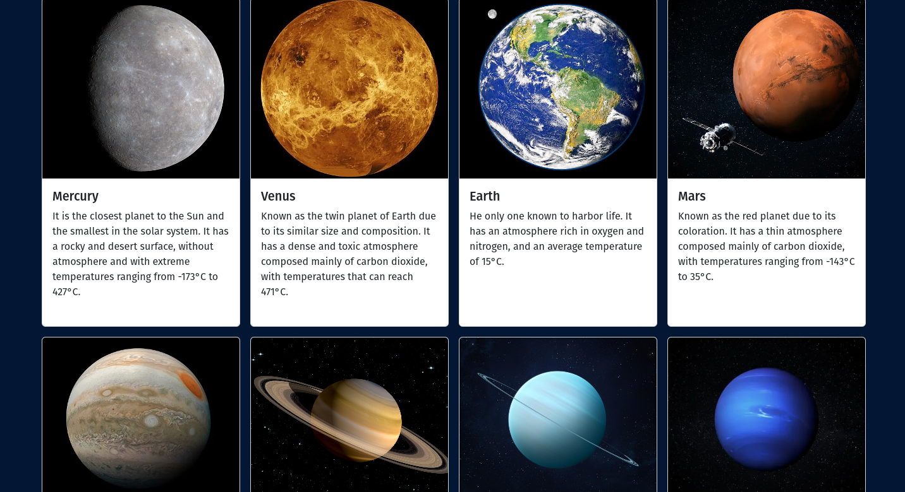
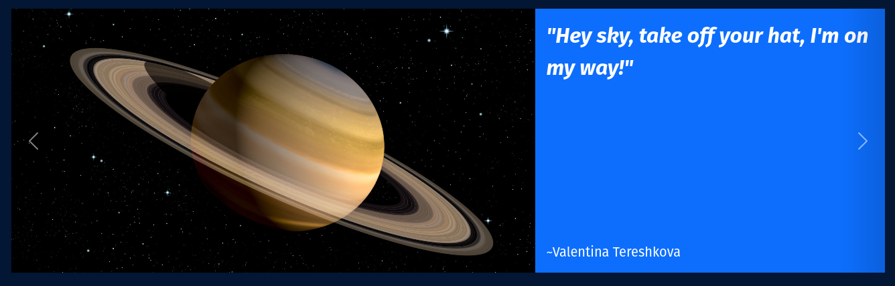
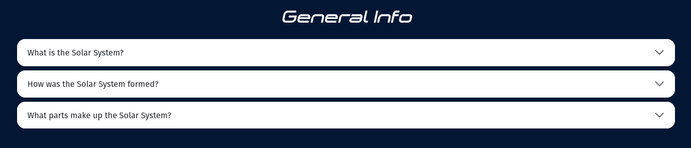
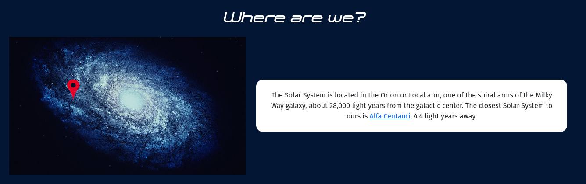
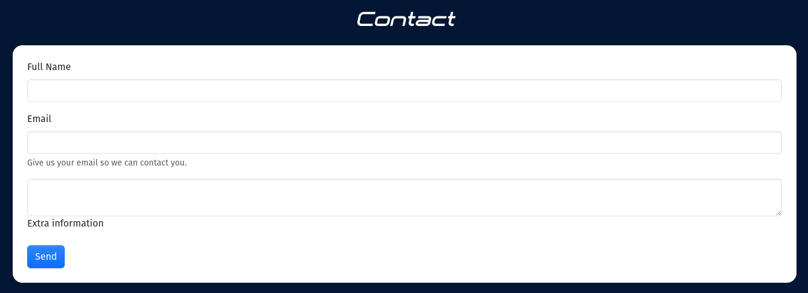

<h1>Memoria del proyecto proyecto de landing page con Bootstrap v5 - 1º DAW</h1>
<h2>Solar-System-BS</h2>
<h2>Indice</h2>
<ul>
  <li><a href="#introduccion">Introducción</a></li>
  <li><a href="#motivacion">Motivación</a></li>
  <li><a href="#estructura">Estructura</a></li>
  <li><a href="#estilo">Estilo</a></li>
</ul>

<h2 id="introduccion">Introducción</h2>

Trabajo realizado en clase por: Álvaro Leiva García

Febrero de 2024 

Licencia CC-BY

<h2 id="motivacion">Motivación</h2>

El tema lo he elegido porque desde pequeño me ha apasionado el espacio y todo lo relacionado con el mismo, pero nunca fui bueno eligiendo temas para trabajos o exposiciones, aun así tuve la suerte de encontrarme un vídeo de Youtube con un comienzo de animación del sistema solar estilo minimalista que me gustó mucho, lo que me motivó a terminarla y modificarla a mi gusto para centrar la temática de mi página en ella. Tras esto decidí mantener la idea, esta vez sin animación y escribirla usando el framework de Bootstrap

<h2 id="estructura">Estructura</h2>

La web está dividida en  6 secciones:

<ul>
  <li>Hero Section</li>  
  <li>Planetas</li>
  <li>Imágenes</li>
  <li>Historia</li>
  <li>Ubicación</li>
  <li>Footer</li>
  <li>Footer</li>
</ul>

<h3>Hero Section</h3>

He optado por un video a pantalla completa, junto al título de la página centrado, el color de fuente es contrario al del fondo, conseguido utilizando reglas CSS

<h3>Introducción</h3>

He dispuesto en un grid de columnas, cuya cantidad dependerá del ancho de la página, haciéndolo completamente responsive gracias a la interfaz que nos proporciona Bootstrap,cada uno con una card que incluye una imagen del planeta a tratar, su nombre y una breve explicación

<h3>Galería</h3>

He optado por utilizar un slideshow de imágenes, el cual fue necesario retocar en varios aspectos a nivel de estilo fundamentalmente para adaptarse a mis necesidades. Mi plan era mantener el diseño de mi proyecto anterior pero empezando por un carousel de la documentación de Bootstrap y editándolo a mi gusto

<h3>Historia</h3>

He utilizado un acordeón con preguntas y respuestas sobre la historia del Sistema Solar. El acordeón ha tenido que ser extraido de los ejemplos de la documentación oficial de Bootstrap v5

<h3>Ubicación</h3>

Se muestra una imagen que señala la posición del Sistema Solar en la Vía Láctea junto a un breve texto explanatorio

<h3>Contacto</h3>

Un pequeño formulario de contacto, por si quieres recibir más información al respecto

<h3>Footer</h3>

He usado un grid de 3 columnas, estructurado mediante Bootstrap con enlaces a los elementos de la página, enlaces a redes sociales (no funcionales) y datos sobre mi y la página genéricos

<h2 id="estilo">Estilo de la página</h2>

SVG de redes sociales copiados de la página de Bootstrap Icons

Imágenes de los 9 planetas del Sistema Solar

Se han utilizado básicamente los colores estándar de BootStrap, aunque en el archivo de styles.scss se han añadido funciones que generan clases de forma dinámica para toda la paleta de colores de Bootstrap, que no viene incluida por defecto, estas clases se han utilizado para diversos colores

<h2 id="snippets">Code snippets</h2>

He utilizado los siguientes:

<ul>
  <li>NavBar: Ejemplos de la documentación de BootStrap, aunque levemente editada para que encaje con el diseño de la página</li>
  <li>Slideshow de imágenes: Ejemplos de la documentación de BootStrap, editado en gran parte para añadir el texto en el lateral</li>
  <li>Acordeón: Ejemplo de la documentación de BootStrap, leves rediseños.</li>
  <li>Contacto: Ejemplo de la documentación de BootStrap, leves rediseños.</li>
</ul>
